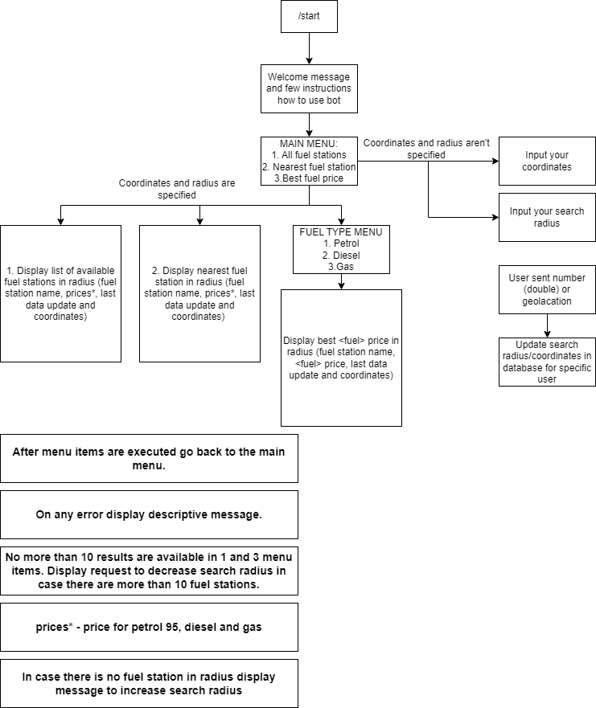
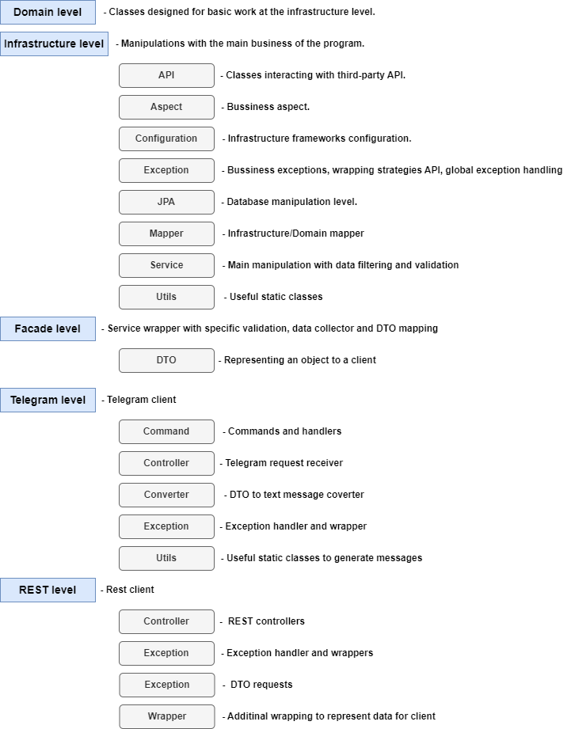
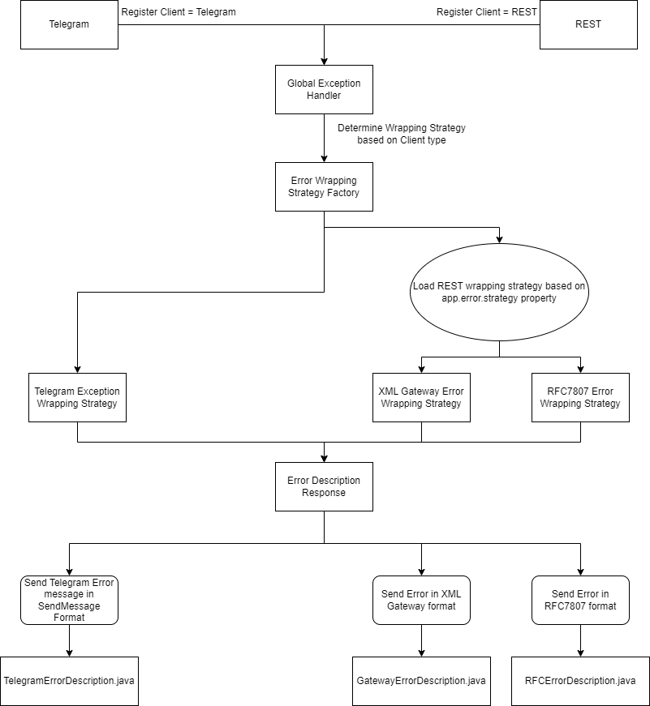

# Moldova — Best Fuel Price Around Me — Telegram bot

<b>This bot is made for educational purposes only and is not used for commercial purposes.</b>

- [API](#api)
- [Telegram Functionality](#telegram-functionality)
- [REST Functionality](#rest-functionality)
- [Project Architecture](#project-architecture)
    - [Package Architecture](#package-architecture)
    - [Exception Architecture](#exception-architecture)
- [Installation](#installation)
    - [Database Installation](#database-installation)
    - [Manual Ngrok Installation](#manual-ngrok-installation)
- [Environment Variables](#environment-variables)
- [Test](#test)
    - [Execution](#execution)
    - [Reports](#reports)
- [Dependency Check](#dependency-check)
- [QA](#qa)
- [Tools](#tools)
- [Useful Resources](#useful-resources)
- [TODO](#todo)

# API

To identify the best fuel price and fuel station location was used: [ANRE-API](https://api.iharta.md/anre/public/)

## Telegram functionality

The User is able to specify a certain search radius and coordinates to execute the following functions:

1. Display all fuel stations (coordinates on map + all available fuel prices).
2. Display nearest fuel station (coordinates on map + all available fuel prices).
3. Display fuel station with the best \<fuel\> price (coordinates on map + \<fuel\> price).

<p align="center">
  
</p>

# REST Functionality

1. Get all fuel stations in radius:

`http://localhost:8080/fuel-station`

| **Request param** | **Optional** |  **Possible Values**  | **Default Value** | **Description**                              |
|:-----------------:|:------------:|:---------------------:|:-----------------:|----------------------------------------------|
|     latitude      |  Partially   | <EPSG:4326 Latitude>  |        0.0        | Latitude (x) coordinate in EPSG:4326 format  |
|     longitude     |  Partially   | <EPSG:4326 Longitude> |        0.0        | Longitude (y) coordinate in EPSG:4326 format |
|      radius       |      No      | \<Radius in meters\>  |         0         | Radius of search in meters                   |
|  limit_in_radius  |  Partially   |    \<Integer > 0\>    |         0         | Number of fuel stations allowed in result    |

Result example:

```json
[
  {
    "name": "FUEL STATION NAME",
    "petrol": 25.1,
    "diesel": 21.05,
    "gas": null,
    "latitude": 46.24415116079208,
    "longitude": 28.76462449820587
  }
]
```

2. Get all fuel stations in radius in page format:

`http://localhost:8080/page/fuel-station`

| **Request param** | **Optional** |  **Possible Values**  | **Default Value** | **Description**                              |
|:-----------------:|:------------:|:---------------------:|:-----------------:|----------------------------------------------|
|     latitude      |  Partially   | <EPSG:4326 Latitude>  |        0.0        | Latitude (x) coordinate in EPSG:4326 format  |
|     longitude     |  Partially   | <EPSG:4326 Longitude> |        0.0        | Longitude (y) coordinate in EPSG:4326 format |
|      radius       |      No      | \<Double value > 0\>  |         0         | Radius of search in meters                   |
|  limit_in_radius  |  Partially   |    \<Integer > 0\>    |         0         | Number of fuel stations allowed in result    |
|       limit       |  Partially   |    \<Integer > 0\>    |         0         | Number of items on the page                  |
|      offset       |  Partially   |    \<Integer > 0\>    |         0         | Number of skipped items from the beginning   |

Result example:

```json
{
  "totalResults": 5,
  "items": [
    {
      "name": "FUEL STATION NAME",
      "petrol": 25.1,
      "diesel": 21.05,
      "gas": null,
      "latitude": 46.24415116079208,
      "longitude": 28.76462449820587
    }
  ]
}
```

3. Get nearest fuel station in radius:

`http://localhost:8080/fuel-station/nearest`

| **Request param** | **Optional** |  **Possible Values**  | **Default Value** | **Description**                              |
|:-----------------:|:------------:|:---------------------:|:-----------------:|----------------------------------------------|
|     latitude      |  Partially   | <EPSG:4326 Latitude>  |        0.0        | Latitude (x) coordinate in EPSG:4326 format  |
|     longitude     |  Partially   | <EPSG:4326 Longitude> |        0.0        | Longitude (y) coordinate in EPSG:4326 format |
|      radius       |      No      | \<Double value > 0\>  |         0         | Radius of search in meters                   |

Result example:

```json
{
  "name": "FUEL STATION NAME",
  "petrol": 25.14,
  "diesel": 21.09,
  "gas": null,
  "latitude": 46.326925437643354,
  "longitude": 28.982692581584732
}
```

4. Get fuel stations with the best-specified fuel type:

`http://localhost:8080/fuel-station/<fuel-type>`

```text
<fuel-type> should be replaced with any of the next values (case insensitive): petrol, diesel, gas
```

| **Request param** | **Optional** |  **Possible Values**  | **Default Value** | **Description**                              |
|:-----------------:|:------------:|:---------------------:|:-----------------:|----------------------------------------------|
|     latitude      |  Partially   | <EPSG:4326 Latitude>  |        0.0        | Latitude (x) coordinate in EPSG:4326 format  |
|     longitude     |  Partially   | <EPSG:4326 Longitude> |        0.0        | Longitude (y) coordinate in EPSG:4326 format |
|      radius       |      No      | \<Double value > 0\>  |         0         | Radius of search in meters                   |
|  limit_in_radius  |  Partially   |    \<Integer > 0\>    |         0         | Number of fuel stations allowed in result    |

Result example:

```json
[
  {
    "name": "FUEL STATION NAME",
    "petrol": 25.1,
    "diesel": 21.05,
    "gas": 13.45,
    "latitude": 46.34746746138542,
    "longitude": 28.947447953963454
  }
]
```

5. Get fuel stations with the best-specified fuel type in page format:

`http://localhost:8080/page/fuel-station/<fuel-type>`

```text
<fuel-type> should be replaced with any of the next values (case insensitive): petrol, diesel, gas
```

| **Request param** | **Optional** |  **Possible Values**  | **Default Value** | **Description**                              |
|:-----------------:|:------------:|:---------------------:|:-----------------:|----------------------------------------------|
|     latitude      |  Partially   | <EPSG:4326 Latitude>  |        0.0        | Latitude (x) coordinate in EPSG:4326 format  |
|     longitude     |  Partially   | <EPSG:4326 Longitude> |        0.0        | Longitude (y) coordinate in EPSG:4326 format |
|      radius       |      No      | \<Double value > 0\>  |         0         | Radius of search in meters                   |
|  limit_in_radius  |  Partially   |    \<Integer > 0\>    |         0         | Number of fuel stations allowed in result    |
|       limit       |  Partially   |    \<Integer > 0\>    |         0         | Number of items on the page                  |
|      offset       |  Partially   |    \<Integer > 0\>    |         0         | Number of skipped items from the beginning   |

Result example:

```json
{
  "totalResults": 1,
  "items": [
    {
      "name": "FUEL STATION NAME",
      "petrol": 25.1,
      "diesel": 21.05,
      "gas": 13.45,
      "latitude": 46.34746746138542,
      "longitude": 28.947447953963454
    }
  ]
}
```

# Project Architecture

## Package Architecture

<p align="center">
  
</p>

## Exception Architecture

<p align="center">
  
</p>

# Installation

## Database Installation

Setting up and installing a database using Docker.

1. Run command: `docker run
   -e POSTGRES_DB=${POSTGRES_DB}
   -e POSTGRES_USER=${POSTGRES_USER}
   -e POSTGRES_PASSWORD=${POSTGRES_PASSWORD}
   -p 5432:5432
   postgres:latest`
2. Provide `DATABASE_URL`, `DATABASE_USERNAME`, `DATABASE_PASSWORD` values in `application.properties` file or as environment
   variables.

- `DATABASE_URL` example: `jdbc:postgresql://localhost:5432/telegram-user-preference`
- Note that the database must exist or use `?createDatabaseIfNotExist=true` in the `DATABASE_URL`.

## Manual Ngrok Installation

+ Program installation: [ngrok](https://ngrok.com/download)

1. Open ngrok.exe and write the command:

```bash
ngrok http 8080
```

+ Docker container: Fetch image from docker hub `docker pull ngrok/ngrok`

1. Run docker image:

`docker run -it -e NGROK_AUTHTOKEN=xyz ngrok/ngrok:latest http host.docker.internal:8080`

(*command specific for Windows and macOS*)

`xyz` - should be your ngrok token, you can take it from: [ngrok](https://dashboard.ngrok.com/get-started/setup)

2. Copy URL with https from Forwarding line

```text
Forwarding http://27fs-299-323-0-285.ngrok.io                    
Forwarding [this URL] -> https://27fs-299-323-0-285.ngrok.io <- [this URL]  
```

(OPTIONAL - manual approach to set up webhook) Paste the required parameters into the link and open it in a browser:

```text
https://api.telegram.org/bot[BOT_TOKEN]/setWebhook?url=[URL_FROM_OPTION_2]
```

If everything is correct, you will see the message:

```text
{"ok":true,"result":true,"description":"Webhook was set"}
```

# Environment Variables

| **Environment Variable** |       **Optional**       | **Possible Values** | **Default Value** | **Description**                                                                                                 |
|:------------------------:|:------------------------:|:-------------------:|:-----------------:|-----------------------------------------------------------------------------------------------------------------|
|        BOT_TOKEN         |            No            | Telegram bot token  |     \<Empty\>     | Telegram bot token (you can take it from [Bot Father](https://t.me/BotFather))                                  |
|      NGROK_ENABLED       |           Yes            |    `true/false`     |       true        | Enable/Disable automatic tunnel creation.                                                                       |
|       NGROK_TOKEN        | Depends on NGROK_ENABLED |  Ngrok auth token   |     \<Empty\>     | If NGROK_ENABLED=true, you must specify a personal ngrok [token](https://dashboard.ngrok.com/get-started/setup) |
|      WEB_HOOK_HOST       | Depends on NGROK_ENABLED | HTTPS WebHook path  |     \<Empty\>     | HTTPS Webhook path that is connected to your telegram bot                                                       |
|     APP_STARTUP_FAST     |           Yes            |    `true/false`     |      `true`       | On true value ANRE API will be called at the start of spring application                                        |
|    APP_ERROR_STRATEGY    |           Yes            |    `RFC7807/XML`    |       `XML`       | Allows to change the way errors are represented between XmlGateway and RFC7807 (REST layer only)                |
|       DATABASE_URL       |            No            |    Database URL     |     \<Empty\>     | PostgreSQL connection URL                                                                                       |
|    DATABASE_USERNAME     |            No            |  Database username  |     \<Empty\>     | PostgreSQL username                                                                                             |
|    DATABASE_PASSWORD     |            No            |  Database password  |     \<Empty\>     | PostgreSQL user password                                                                                        |

Run project via maven:

```bash
./mvnw spring-boot:run -Dspring-boot.run.jvmArguments="-DENV_VARIABLE_1=[ENV_VALUE1] -DENV_VARIABLE_2=[ENV_VALUE1]"
```

# Test

## Execution

How to run project tests:

1. The standard way of launching via IntelliJ IDEA (from it and test packages).
2. Using maven (run from project root):
    - If you have Maven installed:
        - `mvn test` - run unit tests only
        - `mvn verify` - run unit and integration tests
    - If you don't have Maven installed:
        - `.\mvnw test` - run unit tests only
        - `.\mvnw verify` - run unit and integration tests

- Additional maven properties:
    - `-Dskip.unit.tests=true/false` - to enable/disable unit tests phase
    - `-Dskip.integration.tests=true/false` - to enable/disable integration tests phase

## Reports

In order to create Jacoco test coverage reports, you can run next commands:

- Unit tests report:
    - Command: `mvn test`
    - Output directory: `target/site/jacoco-unit-tests-coverage-report/index.html`
- Integration tests report:
    - Command: `mvn verify "-Dskip.unit.tests=true"`
    - Output directory: `target/site/jacoco-integration-test-coverage-report/index.html`
- Merged unit and integration tests report:
    - Command: `mvn verify`
    - Output directory: `target/site/jacoco-merged-tests-coverage.exec/index.html`

# Dependency Check

In order to check for the presence of Vulnerable Dependencies in a project, you can use the following commands:

1. `mvn clean verify` - Full application build and generation of Dependency-Check Report.
2. `mvn dependency-check:check` - Short command to check dependencies.

The end result can be found at: `target/dependency-check-report.html`

# QA

1. (<b>Q</b>) Why is the distance calculation in EPSG:4326?

- This would be faster in an environment where the bot is used by less than 700 people<sup>1</sup> per 15
  minutes<sup>2</sup> to calculate distance in EPSG:3857.

(<b>A</b>) If the task involves web maps and interactive display of data on a plane, EPSG:3857 may be a more appropriate
coordinate system. However, if more accurate distance measurement or working with geodetic data is required,
EPSG:4326 may be preferable.

<sup>1</sup> - The average number of petrol stations received from ANRE: 700-800, it is more profitable to calculate
the distance in the format received from API (EPSG:3857) and convert the user coordinates to the same coordinates
(EPSG:3857) than to convert all petrol station coordinates to EPSG:4326 for users whose number is less than 700. When
the number of users is more than 700-800 people, it is more favourable to convert the coordinates received from ANRE
and calculate the distance in EPSG:4326.<br>
<sup>2</sup> - Cache retention time.

2. (<b>Q</b>) Why is there a limit of 10 petrol stations within a specified radius (Specific for Telegram only)?

(<b>A</b>) This is necessary to improve performance and also to avoid loading the system with large requests. The main
idea of this bot is to find the best fuel price; in case you have more than 10 fuel stations in the specified radius it's better
to go to the nearest one.

# Tools

1. [Telegram Bots Spring Boot Starter](https://mvnrepository.com/artifact/org.telegram/telegrambots-spring-boot-starter)
2. [Spring Boot](https://mvnrepository.com/artifact/org.springframework.boot/spring-boot-starter)
3. [H2](https://mvnrepository.com/artifact/com.h2database/h2)
4. [Lombok](https://mvnrepository.com/artifact/org.projectlombok/lombok)
5. [Proj4J](https://mvnrepository.com/artifact/org.locationtech.proj4j/proj4j)
6. [Proj4J-EPSG](https://mvnrepository.com/artifact/org.locationtech.proj4j/proj4j-epsg)
7. [Mapstruct](https://mvnrepository.com/artifact/org.mapstruct/mapstruct)
8. [Ehcache](https://mvnrepository.com/artifact/org.ehcache/ehcache)
9. [JSR107 API and SPI](https://mvnrepository.com/artifact/javax.cache/cache-api)
10. [Mockito Core](https://mvnrepository.com/artifact/org.mockito/mockito-core)
11. [Mockito Inline](https://mvnrepository.com/artifact/org.mockito/mockito-inline)
12. [JUnit](https://mvnrepository.com/artifact/org.junit.jupiter/junit-jupiter-api)
13. [WireMock](https://mvnrepository.com/artifact/com.github.tomakehurst/wiremock)
14. [PostgreSQL](https://mvnrepository.com/artifact/org.postgresql/postgresql)
15. [Maven Surefire Plugin](https://mvnrepository.com/artifact/org.apache.maven.plugins/maven-surefire-plugin)
16. [Maven Failsafe Plugin](https://mvnrepository.com/artifact/org.apache.maven.plugins/maven-failsafe-plugin)
17. [Maven Jacoco Plugin](https://mvnrepository.com/artifact/org.jacoco/jacoco-maven-plugin)
18. [Maven Dependency Check Plugin](https://mvnrepository.com/artifact/org.owasp/dependency-check-maven)
19. [Java Ngrok](https://mvnrepository.com/artifact/com.github.alexdlaird/java-ngrok)

# Useful Resources

1. [Epsg.io](https://epsg.io/transform)
2. [Gis.stackexchange.com](https://gis.stackexchange.com/)
3. [Earth.google.com](https://earth.google.com/)
4. [Geleot.ru](https://geleot.ru/technology/navigation/coordinate_distance)

# TODO

Read the [TODO](TODO.md) to see the current task list.