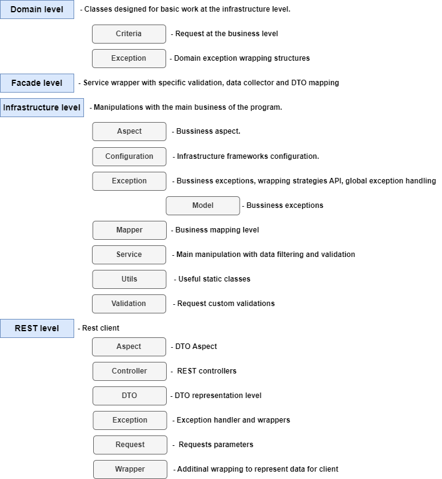

# Moldova Filling Station Rest API

This web service provides the possibility to get different data about filling stations in Moldova in REST-API format.

- [REST API Contracts](#rest-api-contracts)
- [Project Architecture](#project-architecture)
- [Environment Variables](#environment-variables)
- [Test](#test)
- [Plugins](#plugins)
    - [Reports](#reports)
    - [Dependency Check](#dependency-check)
    - [Checkstyle](#checkstyle)
- [Useful Resources](#useful-resources)

# REST API Contracts

Swagger is used to create REST API contracts.

In runtime swagger contracts can be obtained from the [Swagger UI](http://localhost:8080/swagger-ui/index.html)

You can also find current contracts in the file: REST-API.yaml.<br>
Yaml to HTML converter: [Swagger Editor](https://editor.swagger.io/)

# Project Architecture

## Package Architecture



# Environment Variables

| **Environment Variable** | **Optional** | **Possible Values** | **Default Value** | **Description**                                                                |
|:------------------------:|:------------:|:-------------------:|:-----------------:|--------------------------------------------------------------------------------|
|     APP_STARTUP_FAST     |     Yes      |    `true/false`     |      `true`       | On true value ANRE API will be called at the start of spring application       |
|    APP_ERROR_STRATEGY    |     Yes      |    `RFC7807/XML`    |       `XML`       | Allows to change the way errors are represented between XmlGateway and RFC7807 |

Run project via maven:

```bash
./mvnw spring-boot:run -Dspring-boot.run.jvmArguments="-DENV_VARIABLE_1=[ENV_VALUE1] -DENV_VARIABLE_2=[ENV_VALUE1]"
```

# Test

How to run project tests:

1. The standard way of launching via IntelliJ IDEA (from it and test packages).
2. Using maven (run from project root):
    - If you have Maven installed:
        - `mvn test` - run unit tests only
        - `mvn verify` - run unit and integration tests
    - If you don't have Maven installed:
        - `.\mvnw test` - run unit tests only
        - `.\mvnw verify` - run unit and integration tests

- Additional maven properties:
    - `-Dskip.unit.tests=true/false` - to enable/disable unit tests phase
    - `-Dskip.integration.tests=true/false` - to enable/disable integration tests phase

# Plugins

## Reports

In order to create Jacoco test coverage reports, you can run next commands:

- `mvn clean verify` - Complete application build and generate a full jacoco project report.
- Unit tests report:
    - Command: `mvn test`
    - Output directory: `target/site/jacoco-unit-tests-coverage-report/index.html`
- Integration tests report:
    - Command: `mvn verify "-Dskip.unit.tests=true"`
    - Output directory: `target/site/jacoco-integration-test-coverage-report/index.html`
- Merged unit and integration tests report:
    - Command: `mvn verify`
    - Output directory: `target/site/jacoco-merged-tests-coverage.exec/index.html`

## Dependency Check

In order to check for the presence of Vulnerable Dependencies in a project, you can use the following commands:

1. `mvn clean verify` - Complete application build and generate dependency checking report.
2. `mvn dependency-check:check` - Short command to check dependencies.

The end result can be found at: `target/dependency-check-report.html`

## Checkstyle

In order to check project checkstyle, you can use the following commands:

1. `mvn clean verify` - Complete application build and generate the checkstyle.html file.
2. `mvn checkstyle:checkstyle` - Short command to generate checkstyle.html file.

The end result can be found at: `target/checkstyle/ui/checkstyle.html`

# Useful Resources

1. [Epsg.io](https://epsg.io/transform)
2. [Gis.stackexchange.com](https://gis.stackexchange.com/)
3. [Earth.google.com](https://earth.google.com/)
4. [Geleot.ru](https://geleot.ru/technology/navigation/coordinate_distance)
