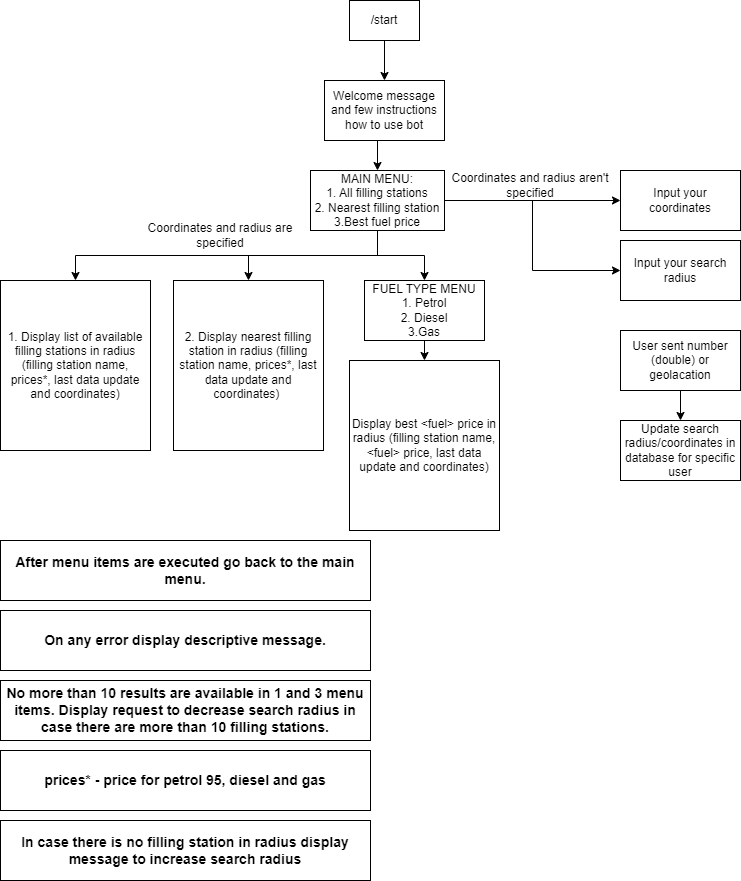
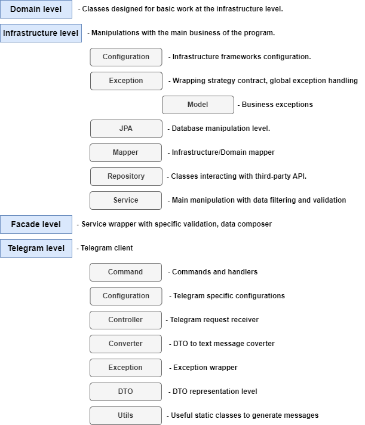

# Moldova Filling Station Telegram Bot

This bot uses telegram messenger for convenient interaction with filling stations in Moldova.

- [Telegram Functionality](#telegram-functionality)
- [Project Architecture](#project-architecture)
- [Environment Variables](#environment-variables)
- [Installation](#installation)
    - [Database Installation](#database-installation)
    - [Flyway](#flyway)
        - [Clean](#clean)
        - [Migrate](#migrate)
- [Test](#test)
- [Plugins](#plugins)
    - [Reports](#reports)
    - [Dependency Check](#dependency-check)
    - [Checkstyle](#checkstyle)
    - [SpotBugs](#spotbugs)
- [Important Notes](#important-notes)
- [QA](#qa)

## Telegram functionality

The User is able to specify a certain search radius and coordinates to execute the following functions:

1. Display all filling stations (coordinates on the map + all available fuel prices).
2. Display the nearest filling station (coordinates on map + all available fuel prices).
3. Display filling station with the best \<fuel\> price (coordinates on map + \<fuel\> price).



# Project Architecture

## Package Architecture



# Installation

## Database Installation

Setting up and installing a database using Docker.

1. Run command: `docker run
   -e POSTGRES_DB=${POSTGRES_DB}
   -e POSTGRES_USER=${POSTGRES_USER}
   -e POSTGRES_PASSWORD=${POSTGRES_PASSWORD}
   -p 5432:5432
   postgres:latest`
2. Provide `DATABASE_URL`, `DATABASE_USERNAME`, `DATABASE_PASSWORD` values in `application.properties` file or as environment
   variables.

- `DATABASE_URL` example: `jdbc:postgresql://localhost:5432/telegram-user-preference`
- Note that the database must exist or use `?createDatabaseIfNotExist=true` in the `DATABASE_URL`.

## Flyway

### Clean

- `cd .\telegram-bot\`
- `mvn flyway:clean "-Dflyway.url=${DATABASE_URL}" "-Dflyway.user=${DATABASE_USERNAME}" "-Dflyway.password=${DATABASE_PASSWORD}"`

### Migrate

1. Automatic migration/validation of SQL scripts on application startup:
    - Set `SPRING_FLYWAY_ENABLED` environment variable to `true`.

2. Using maven:
    - `cd .\telegram-bot\`
    - `mvn flyway:migrate "-Dflyway.url=${DATABASE_URL}" "-Dflyway.user=${DATABASE_USERNAME}" "-Dflyway.password=${DATABASE_PASSWORD}"`

# Environment Variables

|     **Environment Variable**     |       **Optional**       | **Possible Values** | **Default Value** | **Description**                                                                                                 |
|:--------------------------------:|:------------------------:|:-------------------:|:-----------------:|-----------------------------------------------------------------------------------------------------------------|
|           DATABASE_URL           |            No            |    Database URL     |     \<Empty\>     | PostgreSQL connection URL                                                                                       |
|        DATABASE_USERNAME         |            No            |  Database username  |     \<Empty\>     | PostgreSQL username                                                                                             |
|        DATABASE_PASSWORD         |            No            |  Database password  |     \<Empty\>     | PostgreSQL user password                                                                                        |
|      SPRING_FLYWAY_ENABLED       |           Yes            |    `true/false`     |       false       | Checking/applying all SQL scripts in the database/migration folder                                              |
| TELEGRAM_BOT_REQUESTS_PER_SECOND |           Yes            |       Integer       |         5         | Max request per second for specific user                                                                        |
| TELEGRAM_BOT_REQUESTS_TIME_RESET |           Yes            |       Integer       |         3         | Time to reset the counter of all user requests (in seconds)                                                     |

Run project via maven:

```bash
./mvnw spring-boot:run -Dspring-boot.run.jvmArguments="-DENV_VARIABLE_1=[ENV_VALUE1] -DENV_VARIABLE_2=[ENV_VALUE1]"
```

# Test

How to run project tests:

1. The standard way of launching via IntelliJ IDEA (from it and test packages).
2. Using maven (run from project root):
    - If you have Maven installed:
        - `mvn test` - run unit tests only
        - `mvn verify` - run unit and integration tests
    - If you don't have Maven installed:
        - `.\mvnw test` - run unit tests only
        - `.\mvnw verify` - run unit and integration tests

- Additional maven properties:
    - `-Dskip.unit.tests=true/false` - to enable/disable unit tests phase
    - `-Dskip.integration.tests=true/false` - to enable/disable integration tests phase

# Plugins

## Reports

In order to create Jacoco test coverage reports, you can run next commands:

- `mvn clean verify` - Complete application build and generate a full jacoco project report.
- Unit tests report:
    - Command: `mvn test`
    - Output directory: `target/site/jacoco-unit-tests-coverage-report/index.html`
- Integration tests report:
    - Command: `mvn verify "-Dskip.unit.tests=true"`
    - Output directory: `target/site/jacoco-integration-test-coverage-report/index.html`
- Merged unit and integration tests report:
    - Command: `mvn verify`
    - Output directory: `target/site/jacoco-merged-tests-coverage.exec/index.html`

## Actuator

In this project, Spring Boot Actuator is configured to provide access to essential endpoints:

- `management.endpoints.web.exposure.include=health,env,metrics`
- `management.endpoint.env.show-values=ALWAYS`: Displays all environment property values.

These configurations ensure users have access to important application data. You can access the endpoints as follows:

- Base URL: `http://localhost:9090/actuator`
- Health: `http://localhost:9090/actuator/health`
- Environment: `http://localhost:9090/actuator/env`
- Metrics: `http://localhost:9090/actuator/metrics`

For detailed paths:

- Health path template: `http://localhost:9090/actuator/health/{*path}`
- Environment property template: `http://localhost:9090/actuator/env/{toMatch}`
- Specific metric template: `http://localhost:9090/actuator/metrics/{requiredMetricName}`

## Dependency Check

In order to check for the presence of Vulnerable Dependencies in a project, you can use the following commands:

1. `mvn clean verify` - Complete application build and generate dependency checking report.
2. `mvn dependency-check:check` - Short command to check dependencies.

The end result can be found at: `target/dependency-check-report.html`

## Checkstyle

In order to check project checkstyle, you can use the following commands:

1. `mvn clean verify` - Complete application build and generate the checkstyle.html file.
2. `mvn checkstyle:checkstyle` - Short command to generate checkstyle.html file.

The end result can be found at: `target/checkstyle/ui/checkstyle.html`

## SpotBugs

If you want to check the project for the following factors:

- Difficult language features
- Misunderstood API methods
- Misunderstood invariants when code is modified during maintenance
- Garden variety mistakes: typos, use of the wrong boolean operator

You can run the SpotBugs plugin to check:

1. `mvn spotbugs:spotbugs`
2. `mvn spotbugs:gui`

After that, a convenient GUI screen will appear with a presentation of all bugs, bad practices, etc. in project.

# Important Notes

- The Telegram bot can intercept (from rest-api service) in XML format and send errors to the user.
- The default sorting of filling stations in the full list and the search for the best fuel occurs by distance
(the nearest filling station is always the first in the result)

# QA

1. (<b>Q</b>) Why is the distance calculation in EPSG:4326?

- This would be faster in an environment where the bot is used by less than 700 people<sup>1</sup> per 15
  minutes<sup>2</sup> to calculate distance in EPSG:3857.

(<b>A</b>) If the task involves web maps and interactive display of data on a plane, EPSG:3857 may be a more appropriate
coordinate system. However, if more accurate distance measurement or working with geodetic data is required,
EPSG:4326 may be preferable.

<sup>1</sup> - The average number of petrol stations received from ANRE: 700-800, it is more profitable to calculate
the distance in the format received from API (EPSG:3857) and convert the user coordinates to the same coordinates
(EPSG:3857) than to convert all petrol station coordinates to EPSG:4326 for users whose number is less than 700. When
the number of users is more than 700-800 people, it is more favourable to convert the coordinates received from ANRE
and calculate the distance in EPSG:4326.<br>
<sup>2</sup> - Cache retention time.